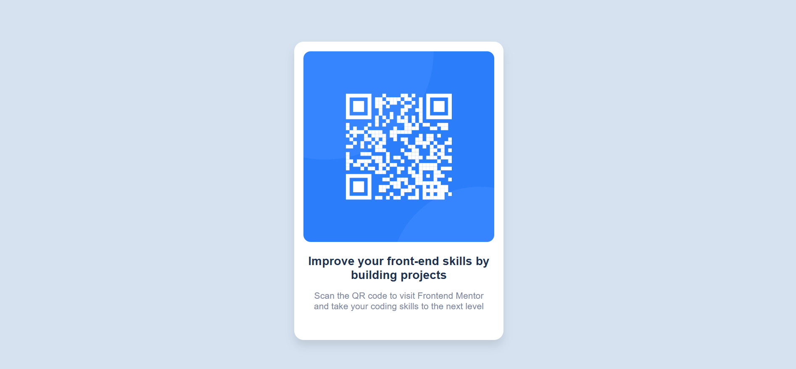

# Frontend Mentor - QR code component solution

## Welcome! 👋

This is my solution to the [QR code component challenge on Frontend Mentor](https://www.frontendmentor.io/challenges/qr-code-component-iux_sIO_H). I built this using basic HTML and CSS as a beginner-friendly practice to sharpen layout, styling, and responsiveness skills.

## Table of contents

- [Overview](#overview)
  - [Links](#links)
  - [Screenshot](#screenshot)
- [My process](#my-process)
  - [Built with](#built-with)
  - [What I learned](#what-i-learned)
  - [Continued development](#continued-development)
  - [Useful resources](#useful-resources)
- [Author](#author)

## Overview

### Links

- Solution URL: [Frontend Mentor Profile](https://www.frontendmentor.io/profile/hepinsuthar)
- Live Site URL: [Live Demo on GitHub Pages](https://hepinsuthar.github.io/qr-code-component)

### Screenshot



## My process

### Built with

- Semantic HTML5
- CSS custom properties
- Flexbox
- Mobile-first workflow

### What I learned

While working on this project, I improved my understanding of:

- How to structure HTML semantically
- Using Flexbox for layout and centering
- Creating a clean and responsive component from a static design

Here’s an example of CSS I used to center the component:

```css
body {
  display: flex;
  justify-content: center;
  align-items: center;
  height: 100vh;
  font-family: 'Outfit', sans-serif;
  background-color: hsl(212, 45%, 89%);
}
